<!-- ============================================================= -->
<!--  HERO - só a ilustração + o slogan ao lado, em três linhas    -->
<!--  (Ciência| Estatística| Sociedade), alternando azul e verde   -->
<!-- ============================================================= -->
```{=html}
<div class="hero-banner">
  <div class="content-container">
    <div class="hero-grid">
      <div class="hero-text">
        <p class="hero-tagline">
          <span>Ciência<span class="tag-barra">|</span></span>
          <span class="tag-verde">Estatística<span class="tag-barra">|</span></span>
          <span>Sociedade</span>
        </p>
      </div>
      <div class="hero-media">
        
      </div>
    </div>
    <!-- Disclaimer provisório: será substituído pelo texto definitivo -->
    <p class="hero-disclaimer">
      Site de projeto vinculado ao Departamento de Estatística da UFLA.
      Este não é um site institucional da Universidade.
    </p>
  </div>
</div>
```

<!-- ============================================================= -->
<!--  O PROJETO - texto simples e clean (só existe aqui na home)   -->
<!-- ============================================================= -->
::: {.content-container}
::: {.intro-block}

Bem-vindo(a) ao **ConectaStat**, um projeto do [Departamento de Estatística](https://des.ufla.br/) da [Universidade Federal de Lavras](https://ufla.br/). Aqui conectamos Ciência, Estatística e Sociedade, tornando o conhecimento científico mais acessível, promovendo o letramento estatístico e aproximando a universidade da comunidade.


:::
:::

<!-- ============================================================= -->
<!--  OPORTUNIDADES - editais internos e de estudo                 -->
<!-- ============================================================= -->
::: {.content-container}
::: {.listing-block}

## Oportunidades

[Editais internos e oportunidades de estudo]{.sec-sub}

::: {#oportunidades}
:::

:::
:::

<!-- ============================================================= -->
<!--  CURSOS E EVENTOS - manchetes rotativas                        -->
<!-- ============================================================= -->
::: {.content-container}
::: {.listing-block}

## Cursos e Eventos

[Cursos, workshops e encontros da comunidade]{.sec-sub}

::: {#eventos}
:::

:::
:::

<!-- ============================================================= -->
<!--  LOCALIZAÇÃO - mapa interativo com rota dentro do site        -->
<!-- ============================================================= -->
::: {.content-container}
::: {.map-block}

## Onde estamos

[Visite o Departamento de Estatística no campus da UFLA]{.sec-sub}

```{=html}
<link rel="stylesheet" href="https://unpkg.com/leaflet@1.9.4/dist/leaflet.css"
      integrity="sha256-p4NxAoJBhIIN+hmNHrzRCf9tD/miZyoHS5obTRR9BMY=" crossorigin=""/>
<script src="https://unpkg.com/leaflet@1.9.4/dist/leaflet.js"
        integrity="sha256-20nQCchB9co0qIjJZRGuk2/Z9VM+kNiyxNV1lvTlZBo=" crossorigin=""></script>

<div class="grid map-grid">
  <div class="g-col-12 g-col-lg-7">
    <div class="map-frame">
      <iframe id="mapa-ufla"
        title="Mapa do campus da UFLA: Departamento de Estatística"
        src="https://www.google.com/maps/d/u/1/embed?mid=1tNF2ofgHMWI2jcaueiX4lIZBgSF4Nss&ehbc=2E312F&noprof=1"
        loading="lazy"></iframe>
    </div>
    <div class="map-frame route-frame" id="rota-frame" hidden>
      <div id="mapa-rota" aria-label="Mapa com a rota até o Departamento de Estatística"></div>
    </div>
    <div class="route-panel">
      <p class="route-label"><i class="bi bi-signpost-2"></i> Calcule a rota até o prédio sem sair do site:</p>
      <div class="route-form">
        <input id="rota-origem" type="text"
               placeholder="Digite seu endereço de partida (rua, cidade)..."
               aria-label="Endereço de partida"/>
        <button id="btn-rota" class="btn-rota" type="button">Calcular rota</button>
        <button id="btn-minha-loc" class="btn-minha-loc" type="button"
                title="Usar minha localização atual">
          <i class="bi bi-crosshair"></i>
        </button>
      </div>
      <p id="rota-status" class="route-status" role="status"></p>
    </div>
  </div>
  <div class="g-col-12 g-col-lg-5">
    <div class="map-info">
      <h3><i class="bi bi-geo-alt-fill"></i> Departamento de Estatística da UFLA</h3>
      <p>
        Trevo Rotatório Professor Edmir Sá Santos, s/n<br/>
        Campus Universitário, Lavras/MG<br/>
        CEP 37203-202 · Caixa Postal 3037
      </p>
      <div class="map-actions">
        <a class="btn-rota"
           href="https://www.google.com/maps/dir/?api=1&destination=-21.2275%2C-44.9770"
           target="_blank" rel="noopener">
          <i class="bi bi-car-front"></i> Rota no Maps
        </a>
        <a class="btn-waze"
           href="https://waze.com/ul?ll=-21.2275,-44.9770&navigate=yes"
           target="_blank" rel="noopener">
          <i class="bi bi-cursor"></i> Abrir no Waze
        </a>
        <button class="btn-compartilhar" id="btn-enviar-gps" type="button">
          <i class="bi bi-phone"></i> Enviar para o celular
        </button>
      </div>
    </div>
  </div>
</div>

<script>
// ============================================================
//  Rota dentro do site: o mapa de rota (Leaflet) só aparece
//  quando o visitante pede; o mapa principal é o My Maps da UFLA
// ============================================================
document.addEventListener("DOMContentLoaded", function () {
  var DES = [-21.2275, -44.9770];   // prédio da Estatística (ajuste fino se necessário)
  var mapa = null;

  // Cria o mapa de rota na primeira vez que for necessário
  function garantirMapaRota() {
    document.getElementById("rota-frame").hidden = false;
    if (mapa) { mapa.invalidateSize(); return; }

    mapa = L.map("mapa-rota", { scrollWheelZoom: false }).setView(DES, 16);
    L.tileLayer("https://{s}.tile.openstreetmap.org/{z}/{x}/{y}.png", {
      maxZoom: 19,
      attribution: "&copy; Contribuidores do OpenStreetMap"
    }).addTo(mapa);

    // Pin 3D estilo "checkpoint", o mesmo da foto do prédio
    var pinIcon = L.divIcon({
      className: "cs-pin-wrapper",
      html: '<div class="cs-pin"><div class="cs-pin-head"><i class="bi bi-geo-alt-fill"></i></div><div class="cs-pin-pulse"></div></div>',
      iconSize: [46, 60],
      iconAnchor: [23, 56]
    });
    L.marker(DES, { icon: pinIcon })
      .addTo(mapa)
      .bindPopup("<strong>Departamento de Estatística da UFLA</strong><br/>Campus Universitário, Lavras/MG");

    // Prédio da Estatística destacado das demais partes do mapa
    var predio = L.polygon([
      [-21.22713, -44.97755],
      [-21.22713, -44.97645],
      [-21.22787, -44.97645],
      [-21.22787, -44.97755]
    ], {
      color: "#146839", weight: 3,
      fillColor: "#1a8a4c", fillOpacity: 0.35
    }).addTo(mapa);
    predio.bindTooltip("Prédio da Estatística", {
      permanent: true, direction: "top", className: "predio-tooltip"
    });

    mapa.invalidateSize();
  }

  var rotaLayer = null;
  var origemMarker = null;
  var status = document.getElementById("rota-status");

  function informar(msg, erro) {
    status.textContent = msg;
    status.classList.toggle("erro", !!erro);
  }

  // Traça a rota dentro do próprio mapa (OSRM)
  async function tracarRota(lat, lon, rotulo) {
    informar("Calculando a rota...");
    garantirMapaRota();
    try {
      var url = "https://router.project-osrm.org/route/v1/driving/" +
        lon + "," + lat + ";" + DES[1] + "," + DES[0] +
        "?overview=full&geometries=geojson";
      var resp = await fetch(url);
      var dados = await resp.json();
      if (!dados.routes || !dados.routes.length) {
        informar("Não foi possível calcular a rota a partir desse ponto.", true);
        return;
      }
      var rota = dados.routes[0];
      if (rotaLayer) mapa.removeLayer(rotaLayer);
      if (origemMarker) mapa.removeLayer(origemMarker);
      rotaLayer = L.geoJSON(rota.geometry, {
        style: { color: "#0d5488", weight: 5, opacity: 0.85 }
      }).addTo(mapa);
      origemMarker = L.circleMarker([lat, lon], {
        radius: 8, color: "#0a3f66", fillColor: "#ffffff", fillOpacity: 1, weight: 3
      }).addTo(mapa).bindPopup(rotulo || "Ponto de partida");
      mapa.fitBounds(rotaLayer.getBounds(), { padding: [30, 30] });
      var km  = (rota.distance / 1000).toFixed(1).replace(".", ",");
      var min = Math.round(rota.duration / 60);
      informar("Rota traçada: " + km + " km, cerca de " + min + " min de carro.");
      document.getElementById("rota-frame").scrollIntoView({ behavior: "smooth", block: "nearest" });
    } catch (e) {
      informar("Erro ao calcular a rota. Tente novamente em instantes.", true);
    }
  }

  // Busca o endereço digitado (Nominatim) e traça a rota
  document.getElementById("btn-rota").addEventListener("click", async function () {
    var q = document.getElementById("rota-origem").value.trim();
    if (!q) { informar("Digite um endereço de partida ou use sua localização.", true); return; }
    informar("Localizando o endereço...");
    try {
      var url = "https://nominatim.openstreetmap.org/search?format=json&limit=1&countrycodes=br&q=" +
        encodeURIComponent(q);
      var resp = await fetch(url);
      var lugares = await resp.json();
      if (!lugares.length) {
        informar("Endereço não encontrado. Inclua a cidade (ex.: Rua X, Lavras MG).", true);
        return;
      }
      tracarRota(parseFloat(lugares[0].lat), parseFloat(lugares[0].lon),
        lugares[0].display_name.split(",").slice(0, 2).join(","));
    } catch (e) {
      informar("Erro ao buscar o endereço. Tente novamente.", true);
    }
  });

  document.getElementById("rota-origem").addEventListener("keydown", function (ev) {
    if (ev.key === "Enter") document.getElementById("btn-rota").click();
  });

  // Usa a localização atual do visitante
  document.getElementById("btn-minha-loc").addEventListener("click", function () {
    if (!navigator.geolocation) {
      informar("Seu navegador não permite acessar a localização.", true);
      return;
    }
    informar("Obtendo sua localização...");
    navigator.geolocation.getCurrentPosition(
      function (pos) { tracarRota(pos.coords.latitude, pos.coords.longitude, "Você está aqui"); },
      function ()    { informar("Não foi possível obter sua localização.", true); }
    );
  });

  // Compartilha a localização com o celular (Web Share API) ou copia o link
  document.getElementById("btn-enviar-gps").addEventListener("click", async function () {
    var url = "https://www.google.com/maps/search/?api=1&query=-21.2275%2C-44.9770";
    var dados = {
      title: "Departamento de Estatística da UFLA",
      text: "Localização do prédio da Estatística no campus da UFLA (Lavras/MG):",
      url: url
    };
    if (navigator.share) {
      try { await navigator.share(dados); } catch (e) { /* usuário cancelou */ }
    } else {
      await navigator.clipboard.writeText(url);
      this.innerHTML = '<i class="bi bi-check2"></i> Link copiado!';
      var btn = this;
      setTimeout(function () {
        btn.innerHTML = '<i class="bi bi-phone"></i> Enviar para o celular';
      }, 2500);
    }
  });
});
</script>
```

:::
:::

<!-- ============================================================= -->
<!--  IPÊS - pétalas amarelas caindo pela página e se acumulando   -->
<!--  no chão, junto ao rodapé (efeito exclusivo da home)          -->
<!-- ============================================================= -->
```{=html}
<script>
document.addEventListener("DOMContentLoaded", function () {
  var CORES = ["#ffd84d", "#f5c31d", "#e8ab00"];
  var reduz = window.matchMedia("(prefers-reduced-motion: reduce)").matches;
  var movel = window.innerWidth < 768;
  var QUANT = reduz ? 0 : (movel ? 8 : 14);   // pétalas caindo ao mesmo tempo
  var CAP   = movel ? 50 : 90;                // máximo acumulado no chão
  var SEED  = reduz ? 26 : 16;                // pétalas já pousadas ao carregar

  // Camada que cobre a página inteira (atrás do conteúdo) + faixa do chão
  var chuva = document.createElement("div");
  chuva.id = "ipe-chuva";
  chuva.setAttribute("aria-hidden", "true");
  var solo = document.createElement("div");
  solo.id = "ipe-solo";
  chuva.appendChild(solo);
  document.body.appendChild(chuva);

  var rodape = document.querySelector(".nav-footer");

  function alturaChao() {
    return rodape
      ? rodape.getBoundingClientRect().top + window.scrollY
      : document.documentElement.scrollHeight - 120;
  }

  function dimensiona() {
    var h = Math.max(600, Math.round(alturaChao()));
    chuva.style.height = h + "px";
    chuva.style.setProperty("--h-queda", (h + 40) + "px");
    if (cochilo) cochilo.style.setProperty("--h-queda", (window.innerHeight + 40) + "px");
  }
  dimensiona();
  window.addEventListener("load", dimensiona);
  var tR;
  function reDimensiona() {
    clearTimeout(tR);
    tR = setTimeout(dimensiona, 200);
  }
  window.addEventListener("resize", reDimensiona);
  // A página muda de altura depois do load (mapas, imagens): o chão acompanha
  if (window.ResizeObserver) {
    new ResizeObserver(reDimensiona).observe(document.body);
  }
  // Garantia extra nos primeiros segundos, quando iframes ainda assentam
  [1000, 3000, 7000].forEach(function (ms) { setTimeout(dimensiona, ms); });

  function sorteia(lista) { return lista[Math.floor(Math.random() * lista.length)]; }

  // Pousa uma pétala no chão (com leve "assentada"); o acúmulo cresce
  // conforme mais pétalas chegam, e as mais antigas somem além do CAP
  var pousadas = [];
  function pousa(xDoc, semAnimacao) {
    var p = document.createElement("span");
    p.className = "ipe-pousada" + (semAnimacao ? "" : " assenta");
    var alt = Math.random() * (12 + Math.min(pousadas.length / 4, 22));
    p.style.setProperty("--tam", (9 + Math.random() * 5).toFixed(1) + "px");
    p.style.setProperty("--cor", sorteia(CORES));
    p.style.setProperty("--rot", Math.round(Math.random() * 360 - 180) + "deg");
    p.style.left = Math.round(xDoc) + "px";
    p.style.bottom = alt.toFixed(1) + "px";
    solo.appendChild(p);
    pousadas.push(p);
    if (pousadas.length > CAP) {
      var velha = pousadas.shift();
      velha.style.transition = "opacity 1.2s ease";
      velha.style.opacity = "0";
      setTimeout(function () { velha.remove(); }, 1300);
    }
  }

  // O chão já começa com algumas pétalas acumuladas
  var larguraUtil = Math.max(320, document.documentElement.clientWidth - 24);
  for (var i = 0; i < SEED; i++) {
    pousa(Math.random() * larguraUtil, true);
  }

  if (QUANT === 0) return;   // usuário prefere menos movimento: só o acúmulo

  function randomiza(q) {
    q.style.left = (1 + Math.random() * 96) + "%";
    q.style.setProperty("--dur", (9 + Math.random() * 8).toFixed(1) + "s");
    q.style.setProperty("--sway", (1.9 + Math.random() * 1.6).toFixed(2) + "s");
    q.style.setProperty("--sway-delay", (-Math.random() * 3).toFixed(2) + "s");
    q.style.setProperty("--amp", Math.round(10 + Math.random() * 14) + "px");
    var pet = q.querySelector(".ipe-petala");
    pet.style.setProperty("--tam", (9 + Math.random() * 5).toFixed(1) + "px");
    pet.style.setProperty("--cor", sorteia(CORES));
  }

  for (var j = 0; j < QUANT; j++) {
    (function () {
      var q = document.createElement("div");
      q.className = "ipe-queda";
      var flutua = document.createElement("div");
      flutua.className = "ipe-flutua";
      var pet = document.createElement("span");
      pet.className = "ipe-petala";
      flutua.appendChild(pet);
      q.appendChild(flutua);
      chuva.appendChild(q);
      randomiza(q);
      // delay negativo: no primeiro carregamento já há pétalas no meio da página
      q.style.setProperty("--delay", (-Math.random() * 9).toFixed(1) + "s");

      q.addEventListener("animationend", function (ev) {
        if (ev.animationName !== "ipe-cai") return;
        // pousa exatamente onde a pétala estava (incluindo o balanço)
        var r = pet.getBoundingClientRect();
        pousa(r.left + window.scrollX + r.width / 2, false);
        // renasce no topo com novos sorteios
        randomiza(q);
        q.style.setProperty("--delay", (Math.random() * 4).toFixed(1) + "s");
        q.style.animation = "none";
        void q.offsetWidth;
        q.style.animation = "";
      });
    })();
  }

  // ---------------------------------------------------------------
  //  COCHILO: 1 minuto sem usar a página e as folhas tomam a tela.
  //  Só uma boa sacudida limpa: mouse, dedo, rolagem ou o celular.
  // ---------------------------------------------------------------
  var OCIOSO_MS = 60000;
  var dormindo = false;
  var ultimaInteracao = Date.now();
  var cochilo = null, aviso = null, spawnTimer = null, avisoTimer = null, montinho = 0;

  ["mousemove", "mousedown", "keydown", "scroll", "touchstart", "wheel"].forEach(function (ev) {
    window.addEventListener(ev, function () {
      if (!dormindo) ultimaInteracao = Date.now();
    }, { passive: true });
  });

  setInterval(function () {
    if (!dormindo && !document.hidden && Date.now() - ultimaInteracao >= OCIOSO_MS) {
      entraCochilo();
    }
  }, 1000);

  // Tempo em outra aba não conta como ociosidade: ao voltar, o relógio zera
  document.addEventListener("visibilitychange", function () {
    if (!document.hidden && !dormindo) ultimaInteracao = Date.now();
  });

  function entraCochilo() {
    dormindo = true;
    montinho = 0;
    cochilo = document.createElement("div");
    cochilo.id = "ipe-cochilo";
    cochilo.setAttribute("aria-hidden", "true");
    cochilo.style.setProperty("--h-queda", (window.innerHeight + 40) + "px");
    document.body.appendChild(cochilo);

    // O aviso chega depois que as primeiras folhas já pousaram
    avisoTimer = setTimeout(function () {
      if (!dormindo) return;
      aviso = document.createElement("button");
      aviso.id = "ipe-aviso";
      aviso.type = "button";
      aviso.innerHTML = '<i class="bi bi-wind"></i> Sacuda para limpar as folhas';
      aviso.title = "Balance o mouse, o dedo, a rolagem ou o celular (ou clique aqui)";
      aviso.addEventListener("click", limpa);
      document.body.appendChild(aviso);
    }, 4000);

    // Folhas caem na janela e vão se amontoando na base da tela
    var CAPTELA = window.innerWidth < 768 ? 140 : 220;
    spawnTimer = setInterval(function () {
      if (document.hidden || montinho >= CAPTELA) return;
      var q = document.createElement("div");
      q.className = "ipe-queda";
      var flutua = document.createElement("div");
      flutua.className = "ipe-flutua";
      var pet = document.createElement("span");
      pet.className = "ipe-petala";
      flutua.appendChild(pet);
      q.appendChild(flutua);
      cochilo.appendChild(q);
      q.style.left = (1 + Math.random() * 96) + "%";
      q.style.setProperty("--dur", (2.4 + Math.random() * 2.2).toFixed(2) + "s");
      q.style.setProperty("--sway", (1.6 + Math.random() * 1.4).toFixed(2) + "s");
      q.style.setProperty("--sway-delay", (-Math.random() * 3).toFixed(2) + "s");
      q.style.setProperty("--amp", Math.round(8 + Math.random() * 12) + "px");
      pet.style.setProperty("--tam", (10 + Math.random() * 6).toFixed(1) + "px");
      pet.style.setProperty("--cor", sorteia(CORES));
      q.addEventListener("animationend", function (ev) {
        if (ev.animationName !== "ipe-cai" || !cochilo) return;
        var r = pet.getBoundingClientRect();
        var p = document.createElement("span");
        p.className = "ipe-pousada assenta";
        p.style.setProperty("--tam", (10 + Math.random() * 6).toFixed(1) + "px");
        p.style.setProperty("--cor", sorteia(CORES));
        p.style.setProperty("--rot", Math.round(Math.random() * 360 - 180) + "deg");
        p.style.left = Math.round(r.left + r.width / 2) + "px";
        var teto = Math.min(20 + montinho * 0.6, window.innerHeight * 0.3);
        p.style.bottom = Math.round(Math.random() * teto) + "px";
        cochilo.appendChild(p);
        montinho++;
        q.remove();
      });
    }, 350);
  }

  function limpa() {
    if (!dormindo || !cochilo) return;
    clearInterval(spawnTimer);
    clearTimeout(avisoTimer);
    // Rajada: todas as folhas voam para o mesmo lado, girando
    var lado = Math.random() < 0.5 ? -1 : 1;
    cochilo.querySelectorAll(".ipe-pousada, .ipe-queda").forEach(function (el) {
      el.style.setProperty("--vx", Math.round(lado * (160 + Math.random() * 520)) + "px");
      el.style.setProperty("--vy", Math.round(-40 - Math.random() * 160) + "px");
      el.style.setProperty("--vr", Math.round(lado * (180 + Math.random() * 420)) + "deg");
      el.style.setProperty("--voa-delay", (Math.random() * 0.25).toFixed(2) + "s");
      el.classList.add("ipe-voa");
    });
    if (aviso) { aviso.remove(); aviso = null; }
    var alvo = cochilo;
    cochilo = null;
    setTimeout(function () { alvo.remove(); }, 1100);
    dormindo = false;
    ultimaInteracao = Date.now();
    zeraSacudida();
  }

  // Sacudida = inversões rápidas de direção em até 1,2 s
  // (mouse, dedo ou rolagem) ou chacoalhada no acelerômetro
  var viradas = [];
  var ultimoX = null, dirX = 0, toqueX = null, dirRolagem = 0, magAnterior = null;

  function registraVirada() {
    if (!dormindo) return;
    var agora = Date.now();
    viradas.push(agora);
    viradas = viradas.filter(function (t) { return agora - t < 1200; });
    if (viradas.length >= 5) limpa();
  }
  function zeraSacudida() {
    viradas = [];
    ultimoX = null; dirX = 0;
    toqueX = null; dirRolagem = 0;
    magAnterior = null;
  }

  window.addEventListener("mousemove", function (e) {
    if (!dormindo) return;
    if (ultimoX !== null) {
      var dx = e.clientX - ultimoX;
      if (Math.abs(dx) > 12) {
        var s = dx > 0 ? 1 : -1;
        if (dirX !== 0 && s !== dirX) registraVirada();
        dirX = s;
      }
    }
    ultimoX = e.clientX;
  }, { passive: true });

  window.addEventListener("touchmove", function (e) {
    if (!dormindo || !e.touches.length) return;
    var x = e.touches[0].clientX;
    if (toqueX !== null) {
      var dx = x - toqueX;
      if (Math.abs(dx) > 14) {
        var s = dx > 0 ? 1 : -1;
        if (dirX !== 0 && s !== dirX) registraVirada();
        dirX = s;
      }
    }
    toqueX = x;
  }, { passive: true });

  window.addEventListener("wheel", function (e) {
    if (!dormindo || !e.deltaY) return;
    var s = e.deltaY > 0 ? 1 : -1;
    if (dirRolagem !== 0 && s !== dirRolagem) registraVirada();
    dirRolagem = s;
  }, { passive: true });

  window.addEventListener("devicemotion", function (e) {
    if (!dormindo || !e.accelerationIncludingGravity) return;
    var a = e.accelerationIncludingGravity;
    var mag = Math.abs(a.x || 0) + Math.abs(a.y || 0) + Math.abs(a.z || 0);
    if (magAnterior !== null && Math.abs(mag - magAnterior) > 22) registraVirada();
    magAnterior = mag;
  });

  window.addEventListener("keydown", function (e) {
    if (dormindo && e.key === "Escape") limpa();
  });
});
</script>
```
